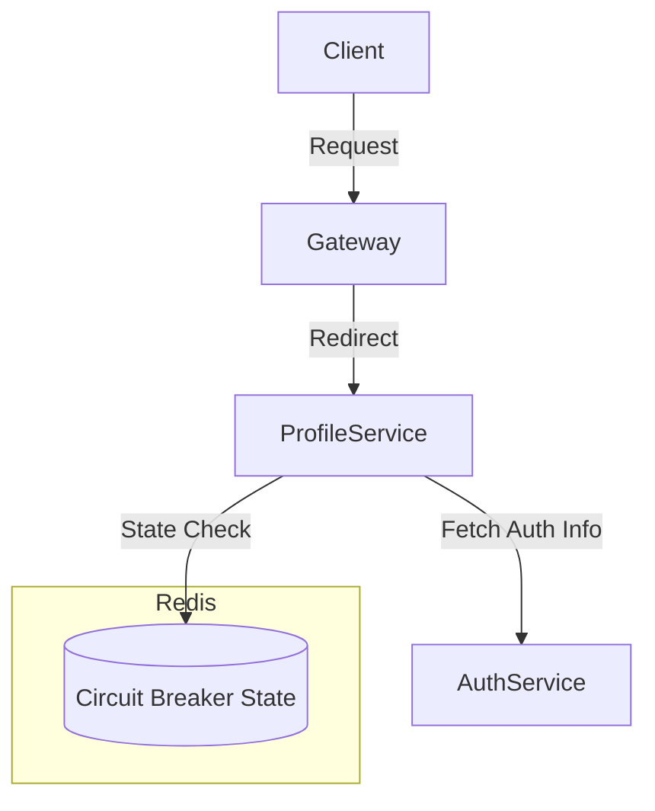

# ⚡ Redis Circuit Breaker Example

> 🛠️ A minimal **distributed circuit breaker implementation** using **Redis**  
> 🚦 Built for **service-to-service communication** with simple **gateway + microservices architecture**

---

## 🌉 Architecture Overview



---

## ✨ Features

- ✅ Simple Gateway to route requests
- ✅ Two microservices: `AuthService` and `ProfileService`
- ✅ Circuit Breaker logic at `ProfileService` to manage `AuthService` calls
- ✅ Redis used for:
  - 🔁 Shared state management (failures, open/close logic)
  - 🌐 Distributed control across instances

---

## 🚦 Circuit Breaker Flow

```
            .---------------------------.
            |  ProfileService          |
            |--------------------------|
Request --> | Is Circuit Open?         |
            |     |                    |
            |    No                    |
            |     ↓                    |
            | Call Auth Service        |
            |     |                    |
            |  Success?                |
            |     |                    |
            |    Yes ----------------> Return Response
            |     ↓
            |  Increment Failure Count
            |     |
            |  Threshold Reached?
            |     ↓
            |   Open Circuit (Redis)
            '---------------------------'
```

---

## 📦 Project Structure

```
📦project-root
 ┣ 📁gateway
 ┃ ┗ 📄index.js
 ┣ 📁auth-service
 ┃ ┗ 📄auth.js
 ┣ 📁profile-service
 ┃ ┗ 📄profile.js  <- Contains Circuit Breaker logic
 ┣ 📁redis
 ┣ 📄README.md
```

---

## 🔧 Custom Logic

- The circuit breaker stores:
  - ✅ Failure count
  - ✅ Last failure timestamp
  - ✅ Cooldown duration
- These are used to determine:
  - 🔁 When to retry
  - 🔒 When to stop calling `AuthService`

Redis Keys:
```bash
cb:auth:state         // OPEN / CLOSED
cb:auth:failures      // Number of failed requests
cb:auth:lastFailure   // Timestamp of last failure
```

---

## 🧩 Future Enhancements

- 🧠 Auto-recovery based on success ratio
- 🔌 Pluggable strategy for breaker logic
- ⚙️ adding correct fallback result

---

## 🎬 Request Flow

```text
Request ---> 🌉 Gateway ---> 👤 ProfileService ---❓---> 🔐 AuthService
                                  |     ▲
                                  ▼     |
                             🧠 Circuit Breaker (Redis)
                                  |
                         [ OPEN 🔴 / CLOSED 🟢 ]
```

---

## 🚀 Quick Start

```bash
# 1. Clone the repository
git clone https://github.com/your-username/redis-circuit-breaker.git
cd circuit-breaker-redis

# 2. Copy the environment file
cp .env.template .env

# 3. Install dependencies for each service
cd gateway && pnpm install
cd ../auth && pnpm install
cd ../profile && pnpm install

# 4. Start everything with Docker Compose
cd ..  # back to project root
docker-compose up
```

> ✅ Make sure Redis is running via Docker Compose.  
> ⚙️ You can modify Redis or service ports in `.env` as needed.


---

> 🧠 **Tip**: This repo shows how you can **build your own Resilience Layer** without 3rd-party libraries using pure Node.js and Redis.

---

## 📜 License

MIT © 2025
